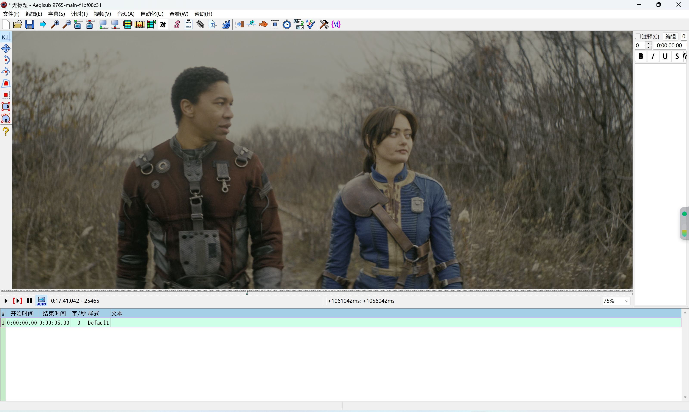

## 硬件加速可用版本
* 支持CUDA、D3D11VA、DXVA2硬件加速解码，优先级为书写顺序
* 暂未支持硬件像素格式直接渲染到界面，意在先降低CPU使用率
* 支持HDR视频载入，展示效果就是不支持HDR的效果
  

## arch1t3cht's Aegisub "fork"
Download release builds [here](https://github.com/arch1t3cht/Aegisub/releases), or the latest CI builds [here](https://github.com/arch1t3cht/Aegisub/actions?query=branch%3Afeature+event%3Apush).

The release page also has detailed list of all changes and new features. If you're interested in the technical details or want to compile yourself, read on.

### Don't we have enough Aegisub forks already??
We absolutely do, and I'm aware that adding another one [doesn't sound like](https://xkcd.com/927/) a [good idea on paper](https://cdn.discordapp.com/attachments/425357202963038208/1007103606421459004/unknown.png). However,

- None of the existing forks are completely satisfying at the moment:
  - [wangqr's fork](https://github.com/wangqr/Aegisub) is actively maintained, but focussing more on stability. It's missing most of the modern features.
  - [AegisubDC](https://github.com/Ristellise/AegisubDC) has the most modern features (in particular video-panning), but is Windows-only and not actively maintained anymore.
  - [The TypesettingTools fork](https://github.com/TypesettingTools/Aegisub) is the one that will one day become the upstream version and builds relatively effortlessly on all operating systems, but at the moment it's not moving much. It's the base for this fork, and I hope to one day merge most of these additions into it.
- Only PR'ing the changes in here to various forks would cause even more chaos
- ~~I try to convince myself that this isn't really a "fork" in the traditional sense - one which aims to provide extended support and stability fixes. It's a collection of new feature additions which I built myself, together with some of the most important new features floating around other forks.~~ At this point it's probably too late to still be saying this. Still, the general mission hasn't changed. This fork collects new features and critical bugfixes, but won't be putting extra time into maintenance aspects like cleanup and refactors. Partly, this is also because any big refactors would make it harder to pull these changes into upstream repositories or future forks.

    While this is usually also the version of Aegisub I'm currently using, I make no promises on stability. **Don't** use this version if you're just looking for any version of Aegisub - this is mostly intended for typesetting and other advanced usage.

### Issues and Pull Requests
Please be aware that, even if this fork is currently effectively the "active Aegisub fork", I cannot promise full maintainership.
The main purpose of this fork is collecting fixes and additions that I am sure are correct (with the goal of complicating the eventual merging of changes and additions upstream as little as possible).
In particular, unsolicited pull requests with large additions are unlikely to get merged here. If you plan to send a large PR, feel free to contact me first to see if I'd be willing to merge it and/or have suggestions on how to implement it.
Similarly, I cannot currently accept PRs that update or add translations to languages that I do not speak myself.
I'm very sorry to have to limit contributions in this way, but I simply do not have the time and resources right now to act as a full maintainer.

As for issues and feature requests, I'll gladly take any bug reports, but if you encounter an issue, please check first if it occurs only on my fork, or also on official Aegisub or [earlier TSTools builds](https://github.com/TypesettingTools/Aegisub/actions).
If it wasn't introduced by my fork, I can still take a look, but I can't promise anything.
Also, in that case, please open the issues at the relevant upstream repositories rather than here. This makes it easier to find issues with *my* additions (which have much higher priority), and keeps the issues around when my fork eventually becomes less relevant.

### Organization
Being a collection of different feature additions, this repository consists of a set of branches for different features, so that they can easily be merged into other repositories. The [`feature`](https://github.com/arch1t3cht/Aegisub/tree/feature) branch merges together all the features I deem as currently usable. Due to the structure of the repository, I will be force-pushing to this branch and some of the individual branches very frequently, so they're not ideal for basing further branches on.

The `cibuilds` branch makes some CI builds of snapshots of `feature` at relevant points in time.

### Branch/Feature list
This list is for navigating the repository. Go to the [release page](https://github.com/arch1t3cht/Aegisub/releases) for a more structured changelog.
- [`folding`](https://github.com/arch1t3cht/Aegisub/tree/folding): Add the ability to visually group and collapse lines in the subtitle grid
- [`lua_api`](https://github.com/arch1t3cht/Aegisub/tree/lua_api): Add new functions to the Lua automation API, like controlling the selection or cursor in the text edit box
- [`vector_clip_actions`](https://github.com/arch1t3cht/Aegisub/tree/vector_clip_actions): Make the different modes of the vector clip tool (lines, bezier curves, adding points, etc) bindable to hotkeys
- [`color_picker_fix2`](https://github.com/arch1t3cht/Aegisub/tree/color_picker_fix2): Add an option (under "Interface") to restrict the color picker to the window, which fixes the color picker on Linux in a lot of cases.
- [`avisynth`](https://github.com/arch1t3cht/Aegisub/tree/avisynth): Reenable Avisynth support on Windows and enable Avisynth on Linux
- [`bestsource`](https://github.com/arch1t3cht/Aegisub/tree/bestsource): Add BestSource audio and video source. This source is slower than others by multiple orders of magnitude, but in exchange it can guarantee exact seeking.
- [`vapoursynth`](https://github.com/arch1t3cht/Aegisub/tree/vapoursynth): Add Vapoursynth audio and video source
- [`bugfixes`](https://github.com/arch1t3cht/Aegisub/tree/bugfixes): Various fixes necessary for compilation. Most branches are based on this.
- [`workarounds`](https://github.com/arch1t3cht/Aegisub/tree/workarounds): Same as `bugfixes`, but these are hacky fixes that probably shouldn't be pulled without more work.
- [`fixes`](https://github.com/arch1t3cht/Aegisub/tree/fixes): Miscellaneous bugfixes
- [`misc`](https://github.com/arch1t3cht/Aegisub/tree/misc): Other miscellaneous additions
- [`wangqr_gui`](https://github.com/arch1t3cht/Aegisub/tree/wangqr_gui): Merge wangqr's changes regarding the GUI. In particular, add high-DPI compatibility.
- [`misc_dc`](https://github.com/arch1t3cht/Aegisub/tree/misc_dc): Miscellaneous changes taken from AegisubDC
- [`xa2-ds`](https://github.com/arch1t3cht/Aegisub/tree/xa2-ds): Add XAudio2 backend and allow stereo playback for some other backends, by wangqr and Shinon.
- [`stereo`](https://github.com/arch1t3cht/Aegisub/tree/stereo): Add multi-channel support for the other audio backends where possible.
- [`video_panning_option`](https://github.com/arch1t3cht/Aegisub/tree/video_panning_option): Merge [moex3's video zoom and panning](https://github.com/TypesettingTools/Aegisub/pull/150), with several bugfixes and more options to control zoom behavior
- [`spectrum-frequency-mapping`](https://github.com/arch1t3cht/Aegisub/tree/spectrum-frequency-mapping): Merge EleonoreMizo's [spectrum display improvements](https://github.com/TypesettingTools/Aegisub/pull/94), and also make Shift+Scroll vertically zoom the audio display
- [`wangqr_time_video`](https://github.com/arch1t3cht/Aegisub/tree/wangqr_time_video): Merge wangqr's feature adding a tool for timing subtitles to changes in the video

### Compilation
If you're just looking to install Aegisub, you might want to check out the [releases page](https://github.com/arch1t3cht/Aegisub/releases) or the [CI builds](https://github.com/arch1t3cht/Aegisub/actions) first.

For compilation on Windows, see the TSTools documentation below. Also check the [GitHub workflow](https://github.com/arch1t3cht/Aegisub/blob/cibuilds/.github/workflows/ci.yml) for the project arguments.

On Arch Linux, there is an AUR package called [aegisub-arch1t3cht-git](https://aur.archlinux.org/packages/aegisub-arch1t3cht-git). It's not maintained by me but seems to work.

On other Linux distributions or for manual compilation you can use this package or the [TSTools PKGBUILD](https://aur.archlinux.org/packages/aegisub-ttools-meson-git) as a reference, in particular for installing the necessary dependencies if you don't want to compile them yourself.
If all dependencies are installed:
- Install Meson
- Clone the repository
- In the repository, run `meson setup build --buildtype=release` for the default configuration. See below for further options.
- `cd` to the `build` directory and run `ninja`
- You'll get an `aegisub` binary in the `build` folder. To install it to a system-wide location, run `ninja install`. To install to `/usr` instead of `/usr/local`, pass `--prefix=/usr` when configuring or reconfiguring meson.
- When recompiling after pulling new commits, skip the `meson setup` setup and just immediately run `ninja` from the build directory - even when the build configuration changed.

#### Compilation flags
Some features are not enabled by default. To enable them, pass `-D<feature>=enabled` with the `meson setup` command:

- `-Davisynth=enabled`: Avisynth support
- `-Dbestsource=enabled`: BestSource
- `-Dvapoursynth=enabled`: Vapoursynth support

You can also disable options that are active by default in the same way. Check the file `meson_options.txt` for all options.

To change the options of an existing build directory, run `meson setup --reconfigure <new arguments>` from inside the `build` directory.

### Dependencies
Apart from the dependencies for the TSTools version, there are some additional dependencies. These are cloned and compiled from scratch if not found, but you might want to install binaries instead:
- `xxhash`: For BestSource
- `ffmpeg`: Becomes a direct dependency when compiling with BestSource
- `avisynth` (or `avisynthplus`): Optional run-time dependency for the Avisynth audio/video provider
- `vapoursynth`: Optional run-time dependency for the VapourSynth audio/video provider

   The following VapourSynth plugins are used by the default scripts set in the default configuration:
   - [`lsmas`](https://github.com/HomeOfAviSynthPlusEvolution/L-SMASH-Works): For LWLibavSource
   - [`bs`](https://github.com/vapoursynth/bestsource): For BestSource, used for audio
   - [`wwxd`](https://github.com/dubhater/vapoursynth-wwxd) and [`scxvid`](https://github.com/dubhater/vapoursynth-scxvid) (depending on settings): For keyframe generation


# Aegisub

For binaries and general information [see the homepage](http://www.aegisub.org).

The bug tracker can be found at https://github.com/Aegisub/Aegisub/issues.

Support is available on [Discord](https://discord.com/invite/AZaVyPr) or [IRC](irc://irc.rizon.net/aegisub).

## Building Aegisub

### Windows

Prerequisites:

1. Visual Studio (Community edition of any recent version is fine, needs the Windows SDK included)
2. Python 3
3. Meson
4. CMake

There are a few optional dependencies that must be installed and on your PATH:

1. msgfmt, to build the translations (installing from https://mlocati.github.io/articles/gettext-iconv-windows.html seems to be the easiest option)
2. InnoSetup, to build the regular installer (iscc.exe on your PATH)
3. 7zip, to build the regular installer (7z.exe on your PATH)
4. Moonscript, to build the regular installer (moonc.exe on your PATH)

All other dependencies are either stored in the repository or are included as submodules.

Building:

1. Clone Aegisub's repository: `git clone https://github.com/arch1t3cht/Aegisub.git`
2. From the Visual Studio "x64 Native Tools Command Prompt", generate the build directory: `meson build -Ddefault_library=static` (if building for release, add `--buildtype=release`)
3. Build with `cd build` and `ninja`

You should now have a binary: `aegisub.exe`.

Installer:

You can generate the installer with `ninja win-installer` after a successful build. This assumes a working internet connection and installation of the optional dependencies.

You can generate the portable zip with `ninja win-portable` after a successful build.

### OS X

A vaguely recent version of Xcode and the corresponding command-line tools are required.

For personal usage, you can use pip and homebrew to install almost all of Aegisub's dependencies:

    pip3 install meson
    brew install cmake ninja pkg-config  libass boost zlib ffms2 fftw hunspell
    export LDFLAGS="-L/usr/local/opt/icu4c/lib"
    export CPPFLAGS="-I/usr/local/opt/icu4c/include"
    export PKG_CONFIG_PATH="/usr/local/opt/icu4c/lib/pkgconfig"

When compiling on Apple Silicon, replace `/usr/local` with `/opt/homebrew`.
When compiling on macOS 15.0 (Sequoia) or later, you may also want to `export MACOS_X_DEPLOYMENT_TARGET=14.0` to make the color picker work.

Once the dependencies are installed, build Aegisub with `meson build && meson compile -C build`.

#### Build dmg

```bash
meson build_static -Ddefault_library=static -Dbuildtype=debugoptimized -Dbuild_osx_bundle=true -Dlocal_boost=true
meson compile -C build_static
meson test -C build_static --verbose
meson compile osx-bundle -C build_static
meson compile osx-build-dmg -C build_static
```

### Linux or other

#### Build dependencies for Debian-based systems

```
compiler:    build-essential
pkgconfig:   pkg-config  or  pkgconf
meson:       meson ninja-build
gettext:     gettext intltool
fontconfig:  libfontconfig1-dev
libass:      libass-dev
boost:       libboost-chrono-dev libboost-locale-dev libboost-regex-dev libboost-system-dev libboost-thread-dev
zlib:        zlib1g-dev
WxWidgets:   wx3.2-headers libwxgtk3.2-dev
ICU:         icu-devtools libicu-dev
pulse-audio: libpulse-dev
ALSA:        libasound2-dev
OpenAL:      libopenal-dev
ffms2:       libffms2-dev
fftw3:       libfftw3-dev
hunspell:    libhunspell-dev
uchardet:    libuchardet-dev
libcurl:     libcurl4-openssl-dev  or  libcurl4-gnutls-dev
opengl:      libgl1-mesa-dev
gtest:       libgtest-dev
gmock:       libgmock-dev
libportal:   libportal-gtk3-dev
```

I.e. to install on Ubuntu 24.04 run this command:
``` bash
sudo apt install build-essential pkg-config meson ninja-build gettext intltool libfontconfig1-dev libass-dev libboost-chrono-dev libboost-locale-dev libboost-regex-dev libboost-system-dev libboost-thread-dev zlib1g-dev wx3.2-headers libwxgtk3.2-dev icu-devtools libicu-dev libpulse-dev libasound2-dev libopenal-dev libffms2-dev libfftw3-dev libhunspell-dev libuchardet-dev libcurl4-gnutls-dev libgl1-mesa-dev libgtest-dev libgmock-dev libportal-gtk3-dev
```

#### Build Aegisub

``` bash
meson setup build --prefix=/usr/local --buildtype=release --strip -Dsystem_luajit=false -Ddefault_library=static
meson compile -C build
meson install -C build --skip-subprojects luajit
```

#### Packaging
If you are packaging Aegisub for a Linux distribution, here are a few things you may need to know:
- Aegisub cannot be built with LTO (See: https://github.com/TypesettingTools/Aegisub/issues/290).
- Aegisub depends on LuaJIT and *requires* LuaJIT to be build with Lua 5.2 compatibility enabled.
  We are aware that most distributions do not compile LuaJIT with this flag, and that this complicates packaging for them, see https://github.com/TypesettingTools/Aegisub/issues/239 for a detailed discussion of the situation.

  Like for its other dependencies, Aegisub includes a meson subproject for LuaJIT that can be used to statically link a version of LuaJIT with 5.2 compatibility.
  For distributions that do not allow downloading additional sources at build time, the downloaded LuaJIT subproject is included in the source tarballs distributed with releases.
- When compiled with gcc (or, more accurately, libstdc++), Aegisub needs gcc 12 or later due to https://gcc.gnu.org/bugzilla/show_bug.cgi?id=95048.
  Aegisub's tests will detect this bug, but if you're not running tests on packaging you'll need to make sure the gcc version is recent enough.

The following commands are an example for how to build Aegisub with the goal of creating a distribution package:

```bash
meson subprojects download luajit              # Or use the tarball
meson subprojects packagefiles --apply luajit

meson setup builddir --wrap-mode=nodownload --prefix=/usr --buildtype=release -Dsystem_luajit=false -Ddefault_library=static -Dtests=false

meson compile -C builddir
meson install -C builddir --skip-subprojects luajit
```

## Updating Moonscript

From within the Moonscript repository, run `bin/moon bin/splat.moon -l moonscript moonscript/ > bin/moonscript.lua`.
Open the newly created `bin/moonscript.lua`, and within it make the following changes:

1. Prepend the final line of the file, `package.preload["moonscript"]()`, with a `return`, producing `return package.preload["moonscript"]()`.
2. Within the function at `package.preload['moonscript.base']`, remove references to `moon_loader`, `insert_loader`, and `remove_loader`. This means removing their declarations, definitions, and entries in the returned table.
3. Within the function at `package.preload['moonscript']`, remove the line `_with_0.insert_loader()`.

The file is now ready for use, to be placed in `automation/include` within the Aegisub repo.

## License

All files in this repository are licensed under various GPL-compatible BSD-style licenses; see LICENCE and the individual source files for more information.
The official Windows and OS X builds are GPLv2 due to including fftw3.
